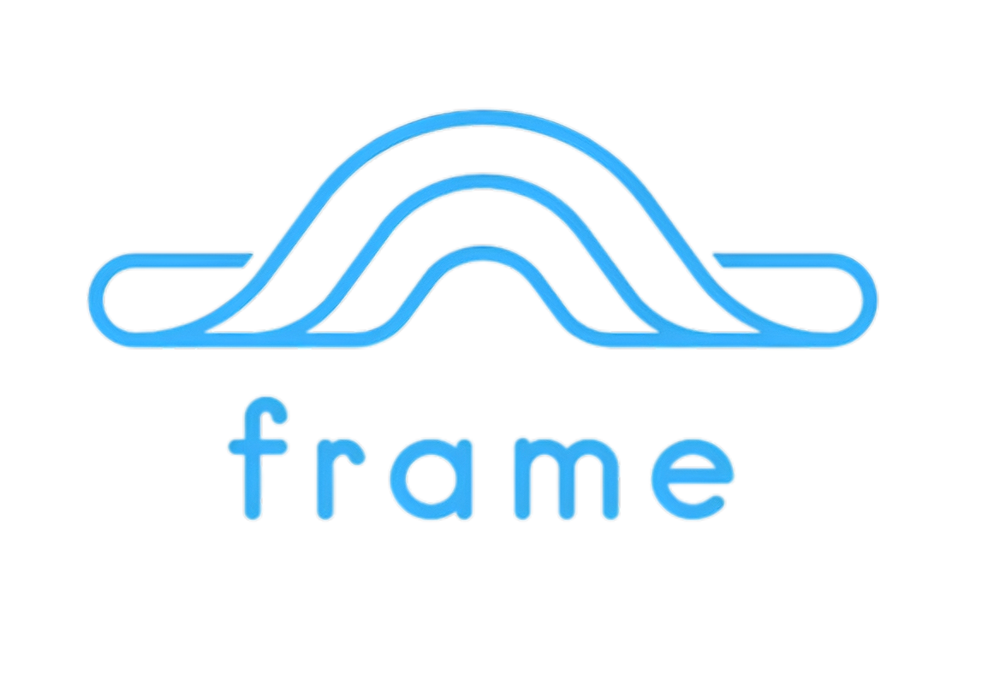

# Frame: Multi-Modal Multi-Agent Cognitive Framework

<div align="center">

  <a href="https://frame.dev">
    
  </a>
  <div align="center" style="margin: auto">
    <!-- Placeholder links with emojis -->
    <a href="#link1" style="margin: 0 10px;">🔗 Link 1</a>
    <a href="#link2" style="margin: 0 10px;">📄 Link 2</a>
    <a href="#link3" style="margin: 0 10px;">📊 Link 3</a>
    <a href="#link4" style="margin: 0 10px;">📚 Link 4</a>
    <a href="#link5" style="margin: 0 10px;">🔍 Link 5</a>
  </div>
</div>

## Overview

Frame is a multi-modal, multi-agent cognitive framework designed to support fully emergent characteristics. Framer agents are fully equipped for task automation and collaborative work. The framework's extensible architecture allows for the integration of custom plugins, enabling developers to tailor the system to specific real-world applications.

### Strategy Pattern and Rules Integration

The Strategy Pattern is a key feature of Frame, allowing for dynamic decision-making based on context. By integrating with rule-based systems, Frame can select the most appropriate strategy for a given situation, enhancing its adaptability and responsiveness.

### Custom Plugins

Frame's plugin system supports the development of custom plugins for unique real-world use cases. These plugins can extend the functionality of Framer agents, enabling them to perform specialized tasks in various domains, such as environmental monitoring, personalized education, and adaptive security systems.

Frame is a multi-modal, multi-agent cognitive framework designed to support fully emergent characteristics. Framer agents are fully equipped for task automation and collaborative work. The framework's extensible architecture allows for the integration of custom plugins, enabling developers to tailor the system to specific real-world applications.

### New Feature: Weather Query Handling

The `WeatherReporter` plugin now includes an action to handle weather queries. It accepts a query and a location, retrieves weather data from the OpenWeatherMap API, and generates a response based on the data. This feature allows the Framer to answer questions like "What's the temperature in Tokyo right now?" by parsing the location from the query and using it to fetch relevant weather information.

### New Feature: Intent Understanding

The `AudioTranscriptionPlugin` now includes an action to understand "intents" from transcriptions. This feature allows the Framer to listen for its name (as specified in the `FramerConfig`) and respond by playing a positive sound and starting to listen to the user, similar to how Alexa functions. This demonstrates how plugins can extend default behavior to create a more helpful assistant, and can be disabled or removed if not needed.


### Permissions

To grant all permissions for all plugins (which is considered unsafe), you can pass `'all'` to the permissions list in the `FramerConfig`. This will enable all available plugins and services without restriction.

### Features

- Multi-modal cognitive agents framework capable of processing diverse types of perceptions
- Supports developing dynamic, emergent behaviors
- Layered memory understanding entity relationships with Mem0
- Supports global and multi-user memory storage
- Extensible architecture with plugin engine allowing for limitless modifications
- Integration with popular AI APIs (OpenAI GPT, Mistral, etc.) as well as local model support
- Streaming text generation support 
- Flexible behavior and decision-making mechanics that can be based off of emotions and memories
- Comprehensive priority system for roles, goals, and tasks, enabling dynamic and context-aware behavior
- Monitoring and metrics; built-in LLM API usage / costs tracking
- Dynamic validation of variables and parameters in decision-making processes to enhance reliability and prevent execution errors.

### Component Hierarchy and Interactions

```
Frame
└── Framer
    ├── Agency
    │   ├── Roles
    │   ├── Goals
    │   ├── Tasks
    │   └── Workflows
    ├── Brain
    │   ├── Mind
    │   │   ├── Perceptions
    │   │   └── Thoughts
    │   ├── Decision
    │   └── Memory
    │   └── Plugins
    ├── Soul
    │   ├── Emotional State
    │   └── Core Traits
    ├── Context
    ├── Observers
    └── Action Registry
Framed
└── Multiple Framers
Services
├── LLM Service
│   └── LLM Adapters
│       └── DSPy Adapter
│       └── HuggingFace Adapter
│       └── LMQL Adapter
├── Memory Service
│   └── Memory Adapters
│       └── Mem0 Adapter
├── EQ Service
└── Context Service
│   └── Execution Context
│   └── Local Context
│   └── Shared Context
```

## Agent Flow

1. **Framer Creation and Initialization**
   - A `Frame` instance creates one or more `Framer` agents.
   - Each `Framer` is initialized with a `Soul` (including a seed story) and an `Agency`.
   - The `Agency` generates roles and goals based on the seed story if not provided.

2. **Perception and Thought Process**
   - The `Framer` receives perceptions through the `sense()` method.
   - Perceptions are processed in the `Soul` and stored in short-term memory.
   - The `Mind` generates new thoughts based on perceptions and memories.

3. **Decision Making**
   - The `Brain` component makes decisions based on current perceptions, memories, and thoughts.
   - **New:** Variables and parameters are validated during decision-making to ensure actions can be executed properly.
   - The `Brain` component makes decisions based on current perceptions, memories, and thoughts.
   - Decisions can lead to actions, new task generation, or changes in the Framer's state.

4. **Workflow and Task Management**
   - Based on the Brain's decisions, the `Agency` may create Workflows and Tasks.
   - The `Agency` manages task prioritization and execution within each Workflow.

5. **Task Execution and Learning**
   - Tasks are executed, updating the Framer's memory and potentially its emotional state.
   - Key information and experiences are stored in long-term and core memory for future use.

6. **Framed Interactions**
   - Multiple Framers can work together in a `Framed` group.
   - Framed groups can process Workflows and Tasks sequentially or in parallel.
   - Inter-Framer communication and task delegation are managed within the Framed context.

## Installation

### Docker

To run the Frame package using Docker, build the Docker image locally:

```bash
docker build -t frame .
```

## Quick Start

### Simple

Here's a simple example to get started with Frame using the synchronous wrapper `SyncFrame`:

```python
from frame.sync_frame import SyncFrame
from frame.src.framer.config import FramerConfig
from frame.src.services.llm.main import LLMService

# Initialize SyncFrame with an LLMService
llm_service = LLMService(api_key="your_api_key")
sync_frame = SyncFrame(llm_service=llm_service)

# Create a Framer instance
config = FramerConfig(name="Example Framer", default_model="gpt-4o-mini")
framer = sync_frame.create_framer(config)

# Define a task
task = {"description": "Engage in a deep conversation"}
result = sync_frame.perform_task(framer, task)
print(f"Task result: {result}")

# Clean up
sync_frame.close_framer(framer)
```

## Chatbot Interaction Example

This example demonstrates how to interact with Frame like a chatbot using both the `prompt` method and the `sense` method with a perception of hearing. Both methods achieve the same result.

```python
import asyncio
from frame import Frame, FramerConfig

async def main():
    # Initialize Frame
    frame = Frame()

    # Create a Framer instance
    config = FramerConfig(name="Chatbot Framer", default_model="gpt-4o-mini")
    framer = await frame.create_framer(config)

    # Using the prompt method
    response = await framer.prompt("Hello, how are you?")
    print(f"Response using prompt: {response}")

    # Using the sense method with a perception of hearing
    perception = {"type": "hearing", "data": {"text": "Hello, how are you?"}}
    decision = await framer.sense(perception)
    if decision:
        response = await framer.agency.execute_decision(decision)
        print(f"Response using sense: {response}")

    await framer.close()

asyncio.run(main())
```

Both methods allow you to interact with Frame as if it were a chatbot, providing flexibility in how you choose to send input.

## Memory Retrieval Example

This example demonstrates how Frame can retrieve information from memory and distinguish between responses that require memory and those that do not. Framer will automatically choose between responding from RAG-like memory augmentation versus a regular response without memory automatically, provided the `with_memory` and `with_mem0_search_extract_summarize_plugin` plugins are provided to a Framer (which are included by default in Frame's package). The Framer takes *no* additional API calls to an LLM service to distinguish between which response type it should pick.

```python
import asyncio
from frame import Frame, FramerConfig

async def main():
    # Initialize Frame
    frame = Frame()

    # Create a Framer instance with memory permissions
    config = FramerConfig(
        name="Memory Framer",
        default_model="gpt-4o-mini",
        permissions=["with_memory", "with_mem0_search_extract_summarize_plugin"]
    )
    framer = await frame.create_framer(config)

    # Add memories
    if framer.brain and framer.brain.memory:
        framer.brain.memory.store("My favorite color is blue.", user_id="user1")
        framer.brain.memory.store("I have a dentist appointment on October 20th.", user_id="user1")
        framer.brain.memory.store("I plan to visit Hawaii for my vacation.", user_id="user1")
    else:
        print("Brain or Memory service is not initialized. Unable to store memories.")

    # Queries
    queries = [
        "What is my favorite color?", # Framer considers this question for memory retrieval
        "When is my next appointment?", # Framer considers this question for memory retrieval
        "What are my vacation plans?", # Framer considers this question for memory retrieval
        "What is the capital of France?" # Framer considers this question as general knowledge it knows
    ]

    for query in queries:
        perception = {"type": "hearing", "data": {"text": query}}
        decision = await framer.sense(perception)
        if decision:
            result = await framer.agency.execute_decision(decision)
            print(f"Query: {query}\nResponse: {result}\n")

    await framer.close()

asyncio.run(main())
```

## Actions / Plugins

Frame features a powerful and flexible plugin system inspired by game mods, allowing developers to extend the functionality of Framers. This system supports a community marketplace where plugins can be shared, sold, or given away, fostering a rich ecosystem of extensions and customizations. Plugins change Framer behaviors by adding or removing actions.

For more detailed information on creating and using plugins, please refer to the [Plugins and Actions documentation](docs/plugins.md).

## Enterprise / Commerical Support

For custom enterprise support, premium plugin development, or custom development, please contact our team at [team@frame.dev](mailto:team@frame.dev) or visit our website at [frame.dev/contact](https://frame.dev/contact).

## License

This project is dual-licensed under the GNU Affero General Public License version 3 (AGPLv3) and a custom proprietary license for certain enterprise use cases. See the [LICENSE](LICENSE) file for details.

## Development

### Testing

To run all tests, navigate to the root directory of the project and execute:

venv\Scripts\activate && pytest
```

*Note*: Testing can take a little while as we have tests for rate limiting / retry logic, so you can exclude those (they are in the `llm_adapter` tests) if it's slow while developing others:

venv\Scripts\activate && pytest -k "not (llm_service or llm_adapter)"
```

### Documentation

The project uses MkDocs and can also use pdoc3 for documentation. The MkDocs config is in `docs/`, and HTML output is also in `docs/`.

To build and serve MkDocs documentation, run:

venv\Scripts\activate && mkdocs serve --config-file ./mkdocs.yml
```

You must run the `roam_links_converter.py` script before to convert linked references to their actual paths. 

To serve both MkDocs and pdoc3 simultaneously, use the following command:

venv\Scripts\activate && python scripts\serve_docs.py
```

This runs MkDocs on port 3010 and pdoc3 on port 3011. This script runs both with live reloading, runs unit tests on initialization and generates a coverage report, and also parses and converts link references automatically. Add `--skip-tests` to skip tests when started.

#### Roam Links Converter

The `roam_links_converter.py` script in `scripts` converts roam-style links (e.g., `[[Link Text]]`) to standard Markdown links. Use it before generating final docs to improve navigation.

To add a doc file to be ignored by the converter, add this anywhere in the markdown file:

```
<!---
roam-ignore
-->
```

#### Commiting Without Docs

If you're developing locally with docs live reloading, you'll have doc files changed with every commit. To avoid this, you can run:

```bash
git add -- . ':!docs'
```

### Linting

```bash
black .
```

## License

This project is dual-licensed under the GNU Affero General Public License version 3 (AGPLv3) and a proprietary license. See the [LICENSE](LICENSE) file for details.

## Custom Enterprise Support

For custom enterprise support, development of features, or plugins, please contact our team at [team@frame.dev](mailto:team@frame.dev) or visit our website at [frame.dev/contact].

## Contributing

Contributions are welcome! Please see the [Contributing](docs/contributing.md) guide for more information.
