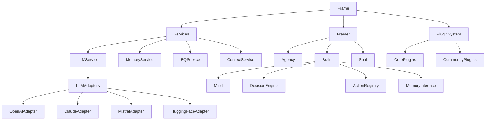

# Frame Architecture

## Overview

Frame is designed with a modular, plugin-based architecture that enables flexible extension and customization. The core components provide essential cognitive agent capabilities, while plugins add specialized features.

## Component Hierarchy

```
Frame
├── Services
│   ├── LLM Service
│   │   └── LLM Adapters
│   │       ├── OpenAI
│   │       ├── Claude
│   │       ├── Mistral
│   │       ├── LMQL
│   │       └── DSPy
│   ├── Memory Service
│   │   └── Memory Adapters
│   │       └── Mem0
│   ├── EQ Service
│   └── Context Service
│       ├── Execution Context
│       ├── Local Context
│       └── Shared Context
└── Framer
    ├── Agency
    │   ├── Roles
    │   ├── Goals
    │   └── Tasks
    ├── Brain
    │   ├── Mind
    │   │   ├── Perceptions
    │   │   └── Thoughts
    │   ├── Decision Engine
    │   ├── Memory Interface
    │   └── Action Registry
    └── Soul
        ├── Emotional State
        └── Core Traits

Plugins (Core)
├── HuggingFace Adapter
│   └── Custom/Uncensored Models
├── Vector Store
├── Speech Processing
├── Computer Vision
└── Memory Management

Plugins (Community)
└── Custom Extensions
```

## Key Components

### Frame
- Central orchestrator
- Creates and manages Framers
- Handles plugin loading/unloading
- Provides service interfaces

### Services
- **LLM Service**: Manages language model interactions
  - Multiple adapter support (OpenAI, Claude, Mistral, etc)
  - Dynamic model selection
  - Rate limiting and retries
- **Memory Service**: Handles memory storage/retrieval
  - Multi-user support
  - Global and local memory contexts
- **EQ Service**: Manages emotional intelligence
- **Context Service**: Manages execution contexts

### Framer
- **Agency**: Handles roles, goals, and tasks
- **Brain**: Core decision making and action execution
- **Soul**: Manages personality and emotional state

### Plugin System
- Modular extension architecture
- Dynamic loading/unloading
- Permission-based access control
- Support for community marketplace

## Import Dependencies



## Plugin Architecture

Plugins in Frame follow a modular architecture:

```
Plugin Directory
├── __init__.py
├── plugin_main.py
├── requirements.txt
└── README.md
```

Each plugin:
- Inherits from BasePlugin
- Implements required interfaces
- Declares permissions
- Manages its own dependencies
- Can extend core services

## Model Support

Frame supports multiple types of language models:

### Cloud APIs
- OpenAI (GPT-3.5, GPT-4)
- Anthropic Claude
- Mistral
- Custom API endpoints

### HuggingFace Integration
- Local model deployment
- Custom/uncensored models
- Fine-tuned models
- Specialized architectures

### Custom Models
- Support for custom model architectures
- Integration with research models
- Experimental model support

## Security and Permissions

Frame implements a granular permissions system:

- Plugin-level permissions
- Service access control
- Model usage restrictions
- Memory access controls

Permissions are declared in FramerConfig and enforced throughout the system.

## Extension Points

Frame provides several extension points:

1. LLM Adapters
   - Custom model integration
   - New API support
   - Model optimization

2. Memory Systems
   - Custom storage backends
   - Specialized indexing
   - Retrieval strategies

3. Decision Making
   - Custom action handlers
   - Specialized behaviors
   - Decision strategies

4. Perception Processing
   - Multi-modal inputs
   - Custom preprocessors
   - Signal processing

## Future Architecture

Planned architectural improvements:

1. Distributed Computing
   - Multi-node support
   - Load balancing
   - High availability

2. Enhanced Security
   - Fine-grained permissions
   - Audit logging
   - Sandbox environments

3. Advanced Plugins
   - Real-time processing
   - Hardware acceleration
   - Cloud integration
